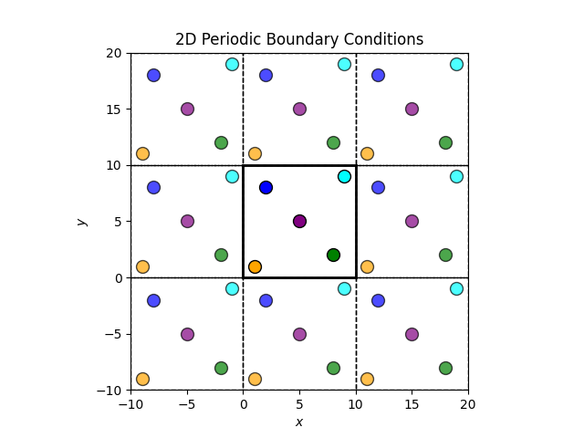
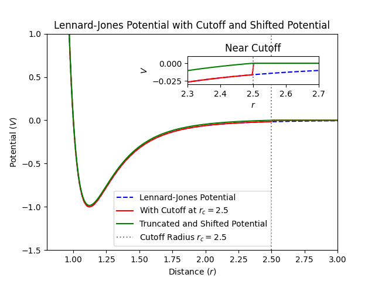

---
jupytext:
  text_representation:
    extension: .md
    format_name: myst
    format_version: '0.13'
    jupytext_version: '1.16.4'
kernelspec:
  display_name: comp-prob-solv
  language: python
  name: python3
---

# Chapter 16: Technical Details: Boundary Conditions, Truncation of Interactions, *Etc.*

## Learning Objectives

By the end of this lecture, you should be able to

1. Explain the importance and implementation of periodic boundary conditions in molecular simulations.
2. Apply the minimum image convention to compute the shortest distance between particles under periodic boundary conditions.
3. Understand and implement interaction truncation methods, including the use of shift functions to handle discontinuities in potential energy functions.

## Introduction

Simulating physical systems at the atomic or molecular level involves managing interactions among a vast number of particles. Directly simulating all these particles is computationally infeasible. To address this challenge, we use techniques such as **periodic boundary conditions** and **interaction truncation** to make simulations manageable while still capturing essential physical behaviors.

## Periodic Boundary Conditions

Consider simulating a macroscopic amount of a substance, like a glass of water, at atomic-level precision. A typical glass contains about 250 mL of water. The number of atoms in such a volume can be estimated

$$
\begin{align*}
\text{Number of atoms} &= 250 \, \text{mL} \times \frac{1 \, \text{g}}{1 \, \text{mL}} \times \frac{1 \, \text{mol}}{18 \, \text{g}} \times \frac{6.022 \times 10^{23} \, \text{molecules}}{1 \, \text{mol}} \times \frac{3 \, \text{atoms}}{1 \, \text{molecule}} \\
&\approx 2.5 \times 10^{25} \, \text{atoms}.
\end{align*}
$$

Simulating this many atoms directly is beyond current computational capabilities. However, we can exploit the fact that many interactions are **short-ranged**, decaying rapidly with distance. This allows us to simulate a smaller, representative system (typically between $10^3$ and $10^9$ atoms) by applying **periodic boundary conditions (PBCs)**.

### Concept of Periodic Boundary Conditions

PBCs mimic an infinite system by repeating a finite simulation box in all spatial directions. Each particle interacts not only with other particles within the box but also with the periodic images of particles in neighboring boxes. This setup eliminates surface effects that would otherwise arise from the finite size of the simulation box.

For example, in two dimensions:



The **central box** is the simulation box and the **surrounding boxes** are periodic images. When a particle moves out of the simulation box, it re-enters from the opposite side, maintaining a constant number of particles.

## Minimum Image Convention

When using PBCs, calculating distances between particles requires careful consideration to ensure interactions are computed correctly. Simply using positions within the simulation box might not yield the shortest distance due to periodic images.

### Calculating the Minimum Image Distance

The **minimum image convention** states that the distance between two particles should be the shortest distance considering all periodic images. For a box with edge length $L$, the minimum image distance $\Delta \mathbf{r}$ between particles at positions $\mathbf{r}_1$ and $\mathbf{r}_2$ is

$$
\Delta \mathbf{r} = \mathbf{r}_1 - \mathbf{r}_2 - L \cdot \text{round}\left(\frac{\mathbf{r}_1 - \mathbf{r}_2}{L}\right),
$$

where $\text{round}$ operates element-wise on vector components, rounding to the nearest integer. This formula maps the displacement vector into the range $\left(-\frac{L}{2}, \frac{L}{2}\right]$, ensuring it corresponds to the minimum image.

#### Implementation of the Minimum Image Convention in Python

Let's implement the minimum image convention in Python for a two-dimensional system.

```{code-cell} ipython3
import numpy as np

def minimum_image_distance(p1, p2, box_size):
    """
    Compute the minimum image distance between two particles p1 and p2
    under periodic boundary conditions in a 2D box.

    Parameters:
    p1, p2 : np.ndarray
        Coordinates of the two particles (2D vectors).
    box_size : float
        Length of the simulation box edge.

    Returns:
    float
        Minimum image distance between p1 and p2.
    """
    delta = p1 - p2
    # Apply minimum image convention
    delta -= box_size * np.round(delta / box_size)
    distance = np.linalg.norm(delta)
    return distance

# Define the box size
box_size = 10.0

# Define positions of the particles
blue_particle = np.array([2.0, 8.0])   # Coordinates of the blue particle
cyan_particle = np.array([9.0, 9.0])   # Coordinates of the cyan particle

# Calculate the minimum image distance
distance = minimum_image_distance(blue_particle, cyan_particle, box_size)
print(f"The minimum image distance between the blue and cyan particles is {distance:.2f} units.")
```

```{admonition} Explanation
:class: dropdown
`delta` calculates the displacement vector between the two particles. The minimum image convention adjusts this displacement to ensure it corresponds to the shortest distance under periodic boundary conditions. The Euclidean norm of the adjusted displacement gives the minimum image distance.
```

```{note}
This implementation assumes a cubic (or square in 2D) simulation box with equal edge lengths and right angles.
```

## Truncation of Interactions

In many-body simulations, the computational cost of calculating interactions scales as $\mathcal{O}(N^2)$. To make simulations feasible, especially for large $N$, we often **truncate interactions** by introducing a cutoff distance $r_c$, beyond which interactions are neglected.

```{admonition} Minimum Image Convention, Truncated Interactions, and Box Size
:class: warning
When using the minimum image convention with truncated interactions, the box size should be chosen such that the cutoff distance $r_c$ is less than half the box size. This ensures that the minimum image distance is always within the cutoff range.
```

### Potential Energy Truncation

Consider the Lennard-Jones potential, describing the interaction between a pair of neutral atoms or molecules

$$
U(r) = 4\varepsilon \left[ \left( \frac{\sigma}{r} \right)^{12} - \left( \frac{\sigma}{r} \right)^6 \right],
$$

where $U(r)$ is the potential energy as a function of distance $r$, $\varepsilon$ is the depth of the potential well (energy scale), and $\sigma$ is the finite distance at which the interparticle potential is zero (length scale). Truncating this potential at $r_c$ sets $U(r) = 0$ for $r \geq r_c$, but introduces a discontinuity at $r = r_c$, leading to non-physical forces due to the abrupt change.



### Shift Function to Smooth the Potential

To mitigate the discontinuity, we can use a **shifted potential** ensuring the potential energy smoothly approaches zero at $r_c$

$$
U_{\text{shifted}}(r) = \begin{cases}
U(r) - U(r_c) & \text{if } r < r_c, \\
0 & \text{if } r \geq r_c.
\end{cases}
$$

By subtracting $U(r_c)$, we ensure $U_{\text{shifted}}(r_c) = 0$, eliminating the discontinuity in potential energy.

```{warning}
While the shift function removes the discontinuity in potential energy at $r = r_c$, it does not eliminate the discontinuity in the force (the derivative of the potential). This can still lead to artifacts in simulations, especially affecting dynamical properties.
```

#### Implementation of a Shifted Lennard-Jones Potential in Python

Implementing the shifted Lennard-Jones potential:

```python
def lennard_jones(r, epsilon, sigma):
    """
    Compute the Lennard-Jones potential energy between two particles
    at distance r.

    Parameters:
    r : float or np.ndarray
        Distance between the two particles.
    epsilon : float
        Depth of the potential well.
    sigma : float
        Finite distance at which the interparticle potential is zero.

    Returns:
    float or np.ndarray
        Potential energy between the two particles.
    """
    sr6 = (sigma / r) ** 6
    return 4 * epsilon * (sr6 ** 2 - sr6)

def lennard_jones_shifted(r, epsilon, sigma, r_c):
    """
    Compute the shifted Lennard-Jones potential energy between two particles
    at distance r.

    Parameters:
    r : float or np.ndarray
        Distance between the two particles.
    epsilon : float
        Depth of the potential well.
    sigma : float
        Finite distance at which the interparticle potential is zero.
    r_c : float
        Cutoff distance.

    Returns:
    float or np.ndarray
        Shifted potential energy between the two particles.
    """
    if r < r_c:
        U = lennard_jones(r, epsilon, sigma)
        U_c = lennard_jones(r_c, epsilon, sigma)
        return U - U_c
    else:
        return 0.0

# Parameters for the Lennard-Jones potential
epsilon = 1.0    # Energy units
sigma = 1.0      # Distance units
r_c = 2.5 * sigma  # Cutoff distance

# Example calculation
r = 2.0  # Distance between particles
energy_shifted = lennard_jones_shifted(r, epsilon, sigma, r_c)
energy_original = lennard_jones(r, epsilon, sigma)

print(f"At distance r = {r}, the shifted Lennard-Jones potential energy is {energy_shifted:.4f}.")
print(f"Without shifting, the Lennard-Jones potential energy is {energy_original:.4f}.")
```

```{admonition} Explanation
:class: dropdown
The `lennard_jones` function calculates the standard Lennard-Jones potential energy $U(r)$, while `lennard_jones_shifted` computes the shifted potential energy $U_{\text{shifted}}(r)$ by subtracting $U(r_c)$ when $r < r_c$. The cutoff handling ensures $U_{\text{shifted}}(r) = 0$ when $r \geq r_c$.
```

```{note}
To further smooth the potential and its derivatives, methods like force shifting or spline smoothing can be employed.
```

## Summary

In this lecture, we explored key technical details essential for efficient and accurate molecular simulations:

- **Periodic Boundary Conditions (PBCs):** Simulate infinite systems by repeating a finite simulation box, reducing finite-size effects.
- **Minimum Image Convention:** Calculate the shortest distance between particles under PBCs by considering the closest periodic image.
- **Truncation of Interactions:** Limit the range of interactions to a cutoff distance to reduce computational cost, and address discontinuities introduced by truncation using shift functions.

Understanding and correctly implementing these concepts are crucial for simulating large systems while maintaining computational efficiency and physical accuracy.
